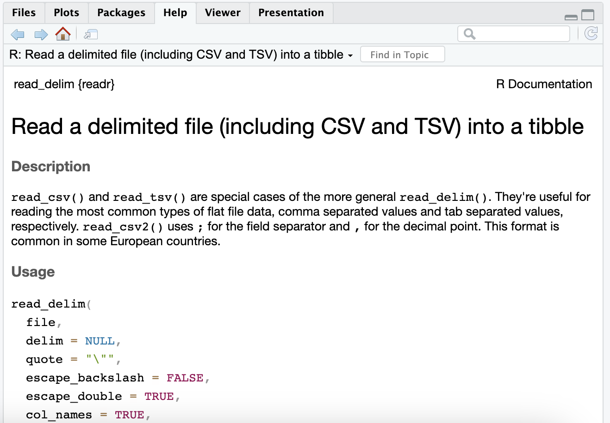

```{r setup, include=FALSE}
knitr::opts_chunk$set(echo = TRUE)
```

<style>
p.comment {
background-color: #DBDBDB;
padding: 10px;
border: 1px solid black;
margin-left: 25px;
border-radius: 5px;
font-style: italic;
}

</style>

<br>
<br>
<div class="alert alert-info">
  <strong>Welcome!</strong> Hope you have watched the lecture videos and followed the instructions in code-along. Go through the steps described below, _carefully_. It is totally fine to get stuck - <strong>ASK FOR HELP</strong>; reach out to your friends, TAs, or the discussion forum on Canvas.
  
&nbsp;

Here is what you have to do,
<br>
<br>

1. <strong>Pair</strong> with a neighbor and work 

2. <strong>Download</strong> the `Challenge-2.Rmd` and `playlist_data.csv` files from Canvas

3. <strong>Move</strong> the downloaded files to the folder, "Week-2"

4. <strong>Set</strong> it as the working directory 

5. <strong>Edit</strong> content wherever indicated 

6. <strong>Remember</strong> to set `EVAL=TRUE` after completing the code to generate the output

7. <strong>Ensure</strong> that `echo=TRUE` so that the code is rendered in the final document

8. <strong>Inform</strong> the tutor/instructor upon completion

9. <strong>Submit</strong> the document on Canvas after they approve

10. <strong>Attendance</strong> will be marked only after submission

11. Once again, <strong>do not hesitate</strong> to reach out to the tutors/instructor, if you are stuck
</div>
<br>

# I. Exploring music preferences

### A. Background

Imagine that you have been hired as a data analyst by a radio station to analyze music preferences of their DJs. They have provided you with a dataset, `playlist_data.csv`, containing information about DJs, their preferred music genres, song titles, and ratings. 

Using the data-set you are required to complete some tasks that are listed subsequently. All these tasks are based on the concepts taught in the video lectures. The questions may not be entirely covered in the lectures; To complete them, you are encouraged to use Google and the resources therein.
<br>

### B.Tasks

#### Task-1

In the lecture, we used two data-sets, `starwars` and `anscombe's quartet` that were readily available with the packages, `tidyverse` and `Tmisc`, respectively. When we have to use custom-made data-sets or the ones like we downloaded from Canvas, we have to import it using the R commands before using them. All the questions below are related to this task.
<br>
<br>

**Question 1.1:** What does the term "CSV" in `playlist_data.csv` stand for, and why is it a popular format for storing tabular data?

**Solution:** A CSV stands for comma-separated values file. It is a simple, compact, and common way to store data. Not only that, it is compatible with all types of spreadsheets.
<br>
<br>
**Question 1.2:** load the `tidyverse` package to work with `.csv` files in R.  

**Solution:** 

```{r,echo=TRUE,EVAL=TRUE}
# Load the necessary package to work with CSV files in R.

library(tidyverse)

```
<br>

**Question 1.3:** Import the data-set, `playlist_data.csv`

**Solution:** 

```{r,echo=TRUE,EVAL=TRUE}
# Import the "playlist_data.csv" dataset into R 

read_csv("playlist_data.csv")

```
<br>

**Question 1.4:** Assign the data-set to a variable, `playlist_data`

**Solution:** 

```{r,echo=TRUE,EVAL=TRUE}
# Assign the variable to a dataset 

Playlist <- read_csv("playlist_data.csv")


```

_From now on, you can use the name of the variable to view the contents of the data-set_
<br>
<br>

**Question 1.5:** Get more information about `read_csv()` command and provide a screenshot of the information displayed in the "Help" tab of the "Files" pane

**Solution:** 

```{r,echo=TRUE,EVAL=TRUE}
# More information about the R command, complete the code

?read_csv()

```
<br>
```{r, out.height= "400px",out.width= "800px",echo=TRUE,EVAL=TRUE,fig.cap="Insert caption here"}

```
<br>

**Question 1.6:** What does the `skip` argument in the read_csv() function do?

**Solution:** The 'skip' argument tells R to ignore a specified number of rows inside the Excel sheets you're trying to pull data from.

<br>
<br>

**Question 1.7:** Display the contents of the data-set

**Solution:** 

```{r,echo=TRUE,EVAL=TRUE}
# Type the name of the variable, to see what it contains

Playlist

```
<br>

**Question 1.8:** Assume you have a CSV file named `sales_data.csv` containing information about sales transactions. How would you use the `read_csv()` function to import this file into R and store it in a variable named `sales_data`?

**Solution:** 

```{r,echo=TRUE,EVAL=TRUE}
# No output is required for this code
# Only the list of commands that execute the task mentioned in the question are required

#read_csv(sales_data.csv)
#sales_data <- read_csv(sales_data.csv)

```
<br>
<br>

#### Task-2

After learning to import a data-set, let us explore the contents of the data-set through the following questions
<br>
<br>

**Question 2.1:** Display the first few rows of the data-set to get an overview of its structure

**Solution:** 

```{r,echo=TRUE,EVAL=TRUE}
# Type the name of the variable we assigned the data-set to
head(Playlist)
```
<br>

**Question 2.2:** Display all the columns of the variable stacked one below another

**Solution:** 

```{r,echo=TRUE,eval=TRUE}
# Stack columns of playlist_data

glimpse(Playlist)


```
<br>

**Question 2.3:** How many columns are there in the dataset?

**Solution:** 

```{r,echo=TRUE,EVAL=TRUE}
# Number of columns

ncol(Playlist)

```
There are 7 columns

**Question 2.4:** What is the total count of DJs?

**Solution:** 

```{r,echo=TRUE,EVAL=TRUE}
# Number of DJs

nrow(Playlist)

```
There are 26 DJs

**Question 2.5:** Display all the location of all the DJs

**Solution:** 

```{r,echo=TRUE,EVAL=TRUE}
# Location of DJs

Playlist$Location


```
<br>

**Question 2.6:** Display the age of the DJs

**Solution:** 

```{r,echo=TRUE,EVAL=TRUE}
# Age of DJs

Playlist$Age


```
<br>
<br>

#### Task-3

Let us plot the data to get more insights about the DJs.
<br>
<br>

**Question 3.1:** Create a plot to visualize the relationship between DJs' ages and their ratings.

**Solution:** 

```{r,echo=TRUE,EVAL=TRUE}
# complete the code to generate the plot

library(ggplot2)

ggplot(data = Playlist) 
```
<br>

**Question 3.2:** Label the x-axis as "Age" and the y-axis as "Rating."

**Solution:** 

```{r,echo=TRUE,EVAL=TRUE}
# complete the code to generate the plot

ggplot(data=Playlist,mapping=aes(x=Age,y=Rating))

```
<br>

**Question 3.3:** Represent data using points

**Solution:** 

```{r,echo=TRUE,EVAL=TRUE}
# complete the code to generate the plot

ggplot(data=Playlist,mapping=aes(x=Age,y=Rating)) +
 geom_point()

```
<br>

**Question 3.4:** Can you change the points represented by dots/small circles to any other shape of your liking?

**Solution:** 

```{r,echo=TRUE,EVAL=TRUE}
# complete the code to generate the plot

?geom_point

ggplot(data=Playlist,mapping=aes(x=Age,y=Rating)) +
geom_point(shape = 5, colour = "black", fill = "white", size = 1, stroke = 1)

```
<br>

**Question 3.5:** Insert a suitable title and briefly provide your insights in the caption

**Solution:** 

```{r,echo=TRUE,EVAL=TRUE}
# complete the code to generate the plot

ggplot(data=Playlist,mapping=aes(x=Age,y=Rating)) +
   geom_point() +
   labs(x="Age",y="Ratings",
 title="Does the age of the DJ affect their ratings?",
 caption="There is no correlation.")
```
<br>

