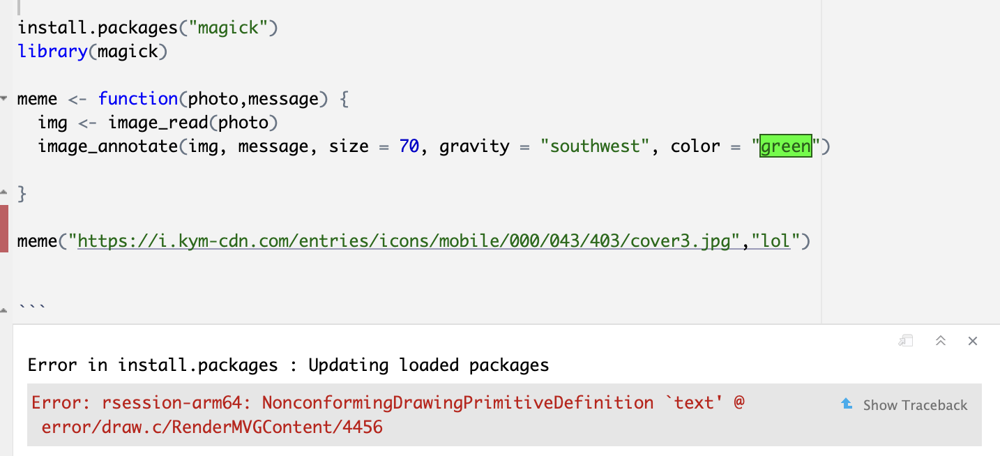

```{r setup, include=FALSE}
knitr::opts_chunk$set(echo = TRUE)
```

## Questions
<br>

#### Question-1: Local Variable Shadowing 

Create an R function that defines a global variable called `x` with a value of 5. Inside the function, declare a local variable also named `x` with a value of 10. Print the value of `x` both inside and outside the function to demonstrate shadowing.

**Solutions:**

```{r, eval=TRUE,echo=TRUE}
# Enter code here

x <- 5

sprintf("The value assigned to x outside the function is %d",x)

huehue <- function() {
  x <- 10
}

print(huehue())
print(x)

```
<br>

#### Question-2: Modify Global Variable

Create an R function that takes an argument and adds it to a global variable called `total`. Call the function multiple times with different arguments to accumulate the values in `total`.

**Solutions:**

```{r, eval=TRUE,echo=TRUE}
# Enter code here

total <- 0

add_to_total <- function(value) {
  total <<- total + value
}

add_to_total(123)
add_to_total(9992)
add_to_total(12)

print(total)

```
<br>

#### Question-3: Global and Local Interaction 

Write an R program that includes a global variable `total` with an initial value of 100. Create a function that takes an argument, adds it to `total`, and returns the updated `total`. Demonstrate how this function interacts with the global variable.

**Solutions:**

```{r, eval=TRUE,echo=TRUE}
# Enter code here

total <- 100

add_to_total <- function(value) {
  total <<- total + value
  return(value)
}

cat("Initial total:", total,"\n")

# Key in any number in add_to_total

cat("Total after adding", add_to_total(444), ":", total,"\n")

cat("Total after adding", add_to_total(30), ":", total,"\n")


```
<br>

#### Question-4: Nested Functions

Define a function `outer_function` that declares a local variable `x` with a value of 5. Inside `outer_function`, define another function `inner_function` that prints the value of `x`. Call both functions to show how the inner function accesses the variable from the outer function's scope.

**Solutions:**

```{r, eval=TRUE,echo=TRUE}
# Enter code here

outer_function <- function() {
  x <- 5
  
  inner_function <- function() {
    print(x)
  }
  
  inner_function()
}

outer_function()
```
<br>

#### Question-5: Meme Generator Function

Create a function that takes a text input and generates a humorous meme with the text overlaid on an image of your choice. You can use the `magick` package for image manipulation. You can find more details about the commands offered by the package, with some examples of annotating images here: https://cran.r-project.org/web/packages/magick/vignettes/intro.html

**Solutions:**

```{r, eval=TRUE,echo=TRUE}
# Enter code here



# Gives me this error :( operating system error T_T

```


<br>

#### Question-6: Text Analysis Game  

Develop a text analysis game in which the user inputs a sentence, and the R function provides statistics like the number of words, characters, and average word length. Reward the user with a "communication skill level" based on their input.

**Solutions:**

```{r, eval=TRUE,echo=TRUE}
# Enter code here

#Type your sentence in between the inverted commas
game <- function() {
  sentence <- "i am a cat"
  
  nword <- length(strsplit(sentence, " ")[[1]])
  ncharacter <- nchar(sentence)
  avg_word_length <- nword / ncharacter
  
   communication_skill_level <- ifelse(avg_word_length < 4, "Beginner",
                                      ifelse(avg_word_length < 6, "Intermediate", "Advanced"))
  
  cat("Number of words:", nword, "\n")
  cat("Number of characters:", ncharacter, "\n")
  cat("Average word length:", avg_word_length, "\n")
  cat("Communication skill level:", communication_skill_level, "\n")
}

game()
```
<br>

```{r, eval=TRUE,echo=TRUE}
# Enter code here

# Initialise x

x<-10

# Assign the value of x to y

y<-x

# Change the value of x

x<-5

cat("x is", x, "y is", y)

```

```{r, eval=TRUE,echo=TRUE}
# Enter code here

carName <- 3

print_car_name <- function(){

names<-c("Volvo", "Mercedes", "Audi", "BMW")

carName<-names[carName]

return(carName)

}

cat("the name of the car you chose is", print_car_name(),", but the value of the variable carName is", carName)

```

```{r, eval=TRUE,echo=TRUE}
# Enter code here

country_names <- c("Zimbabwe", "Singapore", "Iraq", "Malaysia", "Chad")

country_name_length <- function() {
  long_name <- nchar(country_names) > 8
  print(country_names[long_names])
}

country_name_length()

```

```{r, eval=TRUE,echo=TRUE}
# Enter code here

fruits <- c("apple", "banana", "kiwi", "strawberry", "orange", "grape")

long_names <- nchar(fruits) > 6

print(fruits[long_names])

```


Write a function, country_name_length, to identify names of countries longer than 8 characters in the global variable, country_names

a. Initialise a global variable, country_names, with the names of five countries of your choice

b. Pass it as an argument to the function, country_name_length

c. In the local scope, initialise the variable name_length with the lengths of the countries

d. Retrieve the names of the countries longer than 8 characters and store them in local scope in long_names

e. Print the longest name and the length of the name

f. Write a function call to execute the function
```{r, eval=TRUE,echo=TRUE}
# Enter code here

country_names <- c("Argentina", "China", "Azerbaijan", "Indonesia", "Chad")

country_name_length <- function() {
  name_length <- nchar(country_names)
  long_names <- name_length > 8
  
  head(country_names[long_names]),1)
  print(max(name_length))

}

country_name_length()

```

```{r, eval=TRUE,echo=TRUE}
# Enter code here


z <- 1
foo <- function(z = 2) {
  z <- 3
  return(z+3) 
  }

foo(z = 4)

```

```{r, eval=TRUE,echo=TRUE}
# Enter code here

gapminder %>%
  filter(country == "Singapore") %>% 
  summarise(mean_lifeExp = mean(lifeExp)) %>%
  arrange(mean_lifeExp)

```


```{r, eval=TRUE,echo=TRUE}
# Enter code here

gapminder

library(tidyverse)

df <- gapminder %>%
  filter(country == "Singapore")

ggplot(data=df) +
  aes(x=year,y=pop) +
    geom_point() +
      labs(x="Year",
              y="Population",
                title="Singapore’s population from 1952 to 2007")
  

```