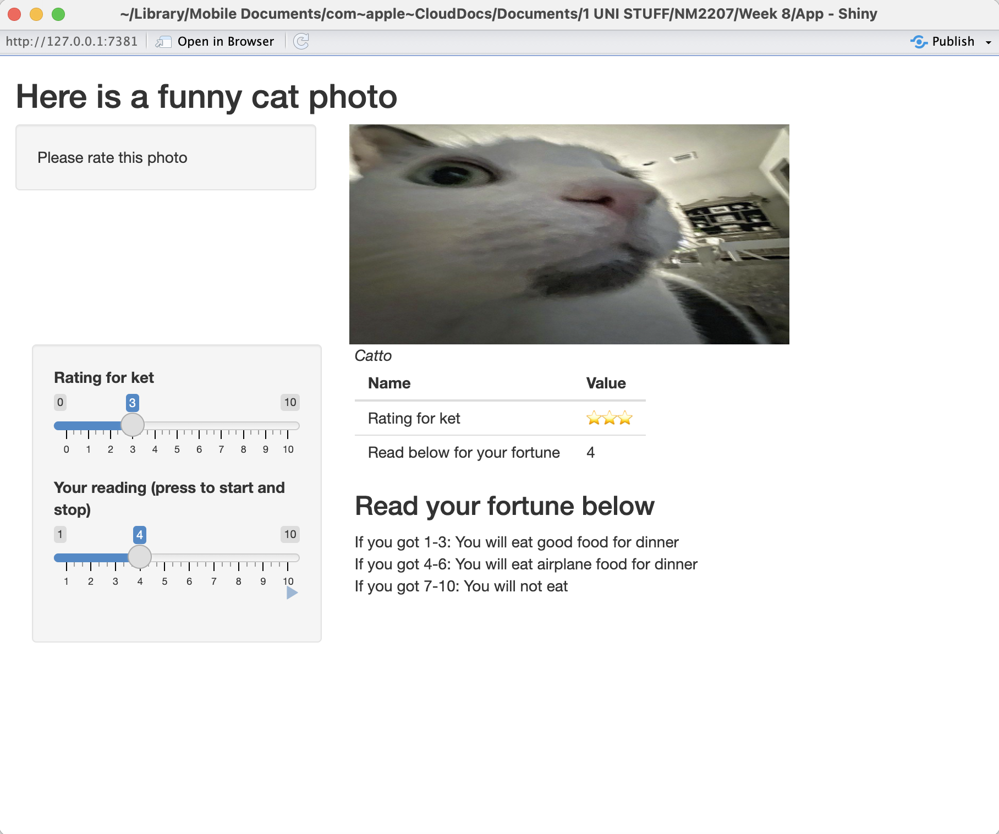

```{r setup, include=FALSE}
knitr::opts_chunk$set(echo = TRUE)
```

```{r, eval=T,echo=TRUE}


```

I used the "05_sliders" example, and only used 2 of the samples (1) the rating, (2) animated loop sliders.

I added a photo of a very cute cat and want people to rate this photo.

The star emojis in the table will correspond to the rating inputted by the user in the slider on the left, with the following code:
```{r, eval=F,echo=TRUE}
generate_star_emojis <- function(rating) {
  stars <- paste0(rep("⭐️", rating), collapse = "")
  return(stars)

```

Then, I set up the app as per normal:

```{r, eval=F,echo=TRUE}
ui <- fluidPage(
  titlePanel("Here is a funny cat photo"),
  sidebarLayout(
    position = "left",
    sidebarPanel("Please rate this photo"),
    mainPanel(
      img(src = "huh.jpeg", height = 200, width = 400)
    )
  ),
  sidebarPanel(
    sliderInput("integer", "Rating for ket",
                min = 0, max = 10,
                value = 5),
    sliderInput("animation", "Your reading (press to start and stop)",
                min = 1, max = 10,
                value = 1, step = 1,
                animate = animationOptions(interval = 3, loop = TRUE))
  ),

```

Thereafter,
```{r, eval=F,echo=TRUE}
em("Catto"),
    br(),
    tableOutput("values"),
    h3("Read your fortune below"),
    "If you got 1-3: You will eat good food for dinner",
    br(),
    "If you got 4-6: You will eat airplane food for dinner",
    br(),
    "If you got 7-10: You will not eat"

```
For a fun interactive portion, the user would be able to have their dinner fortune read. 